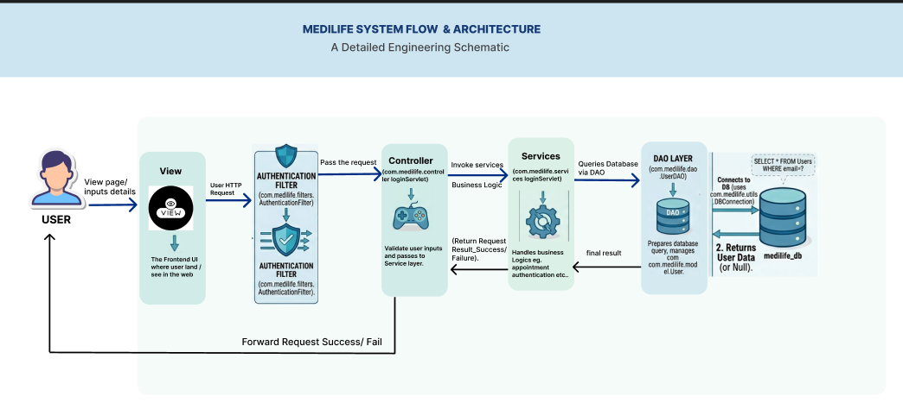

<div align="center">


<br/><br/>

# 🏥 MediLife Hospital Management System

**A full-featured hospital management platform built on Java Jakarta EE — covering patient registration, doctor approval workflows, appointment scheduling, billing, medical records, and admin control — all under strict MVC architecture.**

</div>

---

## 📑 Table of Contents

- [Tech Stack](#-tech-stack)
- [Features](#-features)
- [Architecture](#-architecture)
- [Project Structure](#-project-structure)
- [Setup Guide](#-setup-guide)
- [Default Credentials](#-default-credentials)
- [Developer Notes](#-notes-for-developers)

---

## 🛠 Tech Stack

| Layer | Technology |
|---|---|
| **Language** | Java 21 |
| **Server** | Apache Tomcat 10.1.36 |
| **Database** | MySQL via XAMPP |
| **Build Tool** | Maven |
| **Frontend** | JSP + JSTL + CSS + Vanilla JS |
| **API Spec** | Jakarta EE 5.0 |
| **Password Hashing** | jBCrypt 0.4 |
| **JSON (Backend)** | Gson 2.10.1 |

---

## ✨ Features

<details>
<summary><b>🔐 Authentication & Authorization</b></summary>

- Three-role access control: **Admin**, **Doctor**, **Patient**
- Secure password hashing with **BCrypt**
- Session-based authentication with configurable timeout
- Admin approval workflow for doctor registrations
- Account lock/unlock with reason tracking

</details>

<details>
<summary><b>👤 Patient Portal</b></summary>

- Registration with medical details (blood group, DOB, emergency contact)
- Profile image upload
- **Request Appointment** — describe health problem, admin assigns best-fit doctor
- **Quick Consult** — book directly with a chosen doctor
- View upcoming and past appointments
- Cancel pending appointments
- Medical history with diagnoses and prescriptions

</details>

<details>
<summary><b>🩺 Doctor Portal</b></summary>

- Registration with license document upload (pending admin approval)
- Dashboard with today's appointments and statistics
- Confirm or complete appointments
- **Reject admin-assigned appointments** with reason
- Add diagnosis and prescriptions
- View patient medical history
- Track earnings (total + monthly breakdown)
- Profile and license image management

</details>

<details>
<summary><b>🛡️ Admin Panel</b></summary>

- Dashboard with real-time statistics
- Pending doctor approvals with license document review
- **Appointment request management** — review patient problems and assign doctors
- **Reassign rejected appointments** to different doctors
- User management with view details modal and lock/unlock
- View all appointments with filters, search, and status tabs
- Department management (add, edit, delete)
- Financial reports with CSV export
- System logs with CSV export
- Contact message viewer
- Broadcast announcements to patients

</details>

<details>
<summary><b>📋 Appointments & Billing</b></summary>

- Dual booking flow: **Request Appointment** (admin-assigned) and **Quick Consult** (direct)
- Admin-assigned workflow: Patient → Admin → Doctor (with rejection handling)
- Status workflow: `admin_assigned → pending → confirmed → completed`
- Automatic billing generation upon completion
- Cancellation with reason tracking
- Doctor rejection with reason (reassigned by admin)

</details>

<details>
<summary><b>🔔 Notifications</b></summary>

- Real-time notification bell with unread count
- Triggered by: booking, confirmation, completion, billing, account lock/unlock, doctor assignment, rejection
- Mark as read functionality
- Full notification history page

</details>

<details>
<summary><b>📄 Doctor Portfolios & File Uploads</b></summary>

- Individual public profile pages for featured doctors
- Education timeline, experience, expertise, certifications, publications
- Book appointment CTA with login check
- Profile pictures for patients and doctors
- License documents for doctor verification
- Portable file storage (works across machines)

</details>

*(Only a snippet there are soo many features it not possible to add everythin in here)*

---

## 🏗 Architecture

MediLife follows a strict **Model-View-Controller (MVC)** pattern with a clear separation of concerns across every layer.



| Layer | Location | Responsibility |
|---|---|---|
| **View** | `webapp/WEB-INF/views/` | JSP + JSTL pages — display only, no logic |
| **Controller** | `Controller/` | Servlets — HTTP routing and request/response handling only |
| **Service** | `services/` | All business logic and input validation |
| **DAO** | `dao/` | All database access and SQL queries |
| **Model** | `models/` | Plain entity classes (POJOs) |
| **Filter** | `filter/` | Auth and role-based access control per role |
| **Utils** | `utils/` | Shared helpers: PasswordUtil, SessionUtil, FileUploadUtil, DBConnection |

> **Rule:** Controllers never contain business logic. Services never access the database directly. DAOs never contain logic. Each layer does exactly one job.

---

## 📁 Project Structure  
*(Only a partial view shown due to overall size being a bit too big — this is just a snippet)*

```
Hospital-Management-System/
│
├── src/
│   └── main/
│       ├── java/
│       │   ├── Controller/          # Servlets — routing only
│       │   ├── dao/                 # Data Access Objects (SQL queries)
│       │   ├── filter/              # Auth filters (Admin, Doctor, Patient, logs)
│       │   ├── models/              # Entity classes (User, Doctor, Appointment…)
│       │   ├── services/            # Business logic layer
│       │   └── utils/               # PasswordUtil, SessionUtil, FileUploadUtil, DBConnection
│       │
│       └── webapp/
│           ├── CSS/                 # Global stylesheets
│           ├── Public/              # Static assets (images/icon for web)
│           ├── components/          # Reusable JSP fragments (header, footer, sidebar)
│           ├── index.jsp            # Public landing page
│           │
│           └── WEB-INF/ 
│               └── views/           # Protected JSP pages
│                   ├── admin/
│                   ├── doctor/
│                   ├── patient/
│                   └── profile/
│
├── schema.sql                       # Full DB schema + seed data
└── pom.xml                          # Maven dependencies
```

---

## 🚀 Setup Guide

### Prerequisites

Before you begin, install the following:

| Tool | Version | Download |
|---|---|---|
| JDK | 21 | [Download](https://www.oracle.com/java/technologies/downloads/) |
| Apache Tomcat | 10.1.36 | [Download](https://tomcat.apache.org/download-10.cgi) |
| XAMPP | Latest | [Download](https://www.apachefriends.org/) |
| Eclipse IDE (Enterprise Java) | Latest | [Download](https://www.eclipse.org/downloads/) |

> Maven is bundled with Eclipse — no separate installation needed.

---

### Step 1 — Database Setup

1. Open **XAMPP Control Panel** and start **Apache** and **MySQL**
2. Navigate to `http://localhost/phpmyadmin`
3. Click **New** → create a database named `medilife_hms`
4. Select `medilife_hms` → click the **Import** tab
5. Choose `schema.sql` from the project root
6. Click **Go** — all tables and seed data will be created

---

### Step 2 — Configure Tomcat in Eclipse

1. Open Eclipse → **Window → Preferences → Server → Runtime Environments**
2. Click **Add → Apache → Apache Tomcat 10.1**
3. Browse to your Tomcat installation folder
4. Click **Finish**

---

### Step 3 — Import the Project

1. **File → Import → Existing Maven Projects**
2. Browse to the project folder (ensure `pom.xml` is detected)
3. Click **Finish**
4. Wait for Maven to resolve all dependencies

---

### Step 4 — Run the Application

1. Right-click the project → **Run As → Run on Server**
2. Select **Tomcat 10.1** → click **Finish**
3. The app will launch at:

```
http://localhost:8080/Hospital-Management-System/
```

---

## 🔑 Default Credentials

| Role | Username | Password | Login URL |
|---|---|---|---|
| **Admin** | `admin` | `admin123` | `/admin/login` |
| **Doctor** | Register via form | — | `/login` |
| **Patient** | Register via form | — | `/login` |

> ⚠️ **Doctor accounts require admin approval before they can log in.** After a doctor registers, check the Admin Dashboard under **Pending Approvals**.

---

## 📝 Notes for Developers

**MVC Discipline**
Controllers handle routing only. All business logic lives in `services/`. Database access is exclusively through `dao/`. Never cross these boundaries.

**Session Management**
All session keys are centralized in `SessionUtil.java`. Always use the provided helper methods (`isAdminLoggedIn()`, `isPatient()`, `getUserId()`) instead of raw session attribute access.

**JavaScript Policy**
JS is limited to UI operations — show/hide modals, client-side form validation, DOM manipulation. No `fetch()` or AJAX calls for data. All data is rendered server-side via JSTL and EL expressions.

**JSP Standards**
All JSP pages use JSTL/EL tags exclusively. Scriptlets (`<% %>`) are strictly prohibited.

**Password Security**
Passwords are hashed with BCrypt via `utils/PasswordUtil.java`. Plain-text passwords never reach the database at any point.

**File Uploads**
Uploaded files (profile photos, license documents) are stored at `{user.home}/medilife_uploads/uploads/` for portability across different machines and OS environments.

**Form Methods**
All data submission uses `POST`. All data retrieval uses `GET`. No exceptions.

**Database**
Always run `schema.sql` on a fresh setup. It creates all tables, constraints, indexes, and inserts the default admin account.

---

<div align="center">

Made with ❤️ for better healthcare management by Sabin Team

</div>
